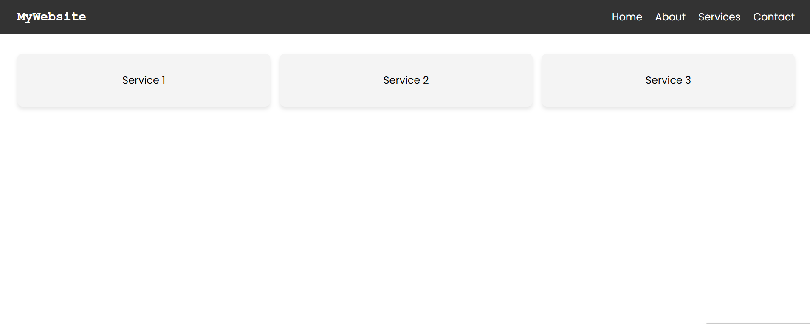

# services-landing-page
A responsive services landing page built with HTML and CSS to practice layout and styling.

## Features 
- Responsive navigation bar
- Services cards with hover effect
- Clean and modern UI
- Mobile-friendly layout

## Tech Stack
- HTML
- CSS

## Screenshot

## How to Use
1. Download or clone this repository
2. Open the project folder
3. Run `index.html` in your browser

## Future Improvements
- Contact Form with Validation

- Testimonials/Reviews section

- Blog/Articles section

- Newsletter Subscription

- Service Pricing Table

- Responsive Hero Section with Call-to-Action

- Footer with social links, privacy, contact

- Improve UI with CSS animations & hover transitions

- Later: Add Dark Mode toggle for modern look
## License
This project is licensed under the MIT License - feel free to use and modify.